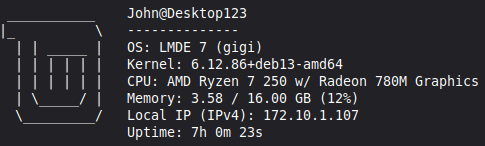

A minimal and lightweight command-line tool inspired by [Neofetch](https://github.com/dylanaraps/neofetch) and written in Go. Dfetch shows information relating to your OS, hardware and software in a visually pleasing way.

### Example output



### File structure

```
Dfetch
├── cusomization
│   ├── configfile.go    # Handles config file operations
│   └── colors.go        # Supported colors
│
├── getsysinfo
│   ├── cpu.go           # CPU information
│   ├── distro.go        # Linux distribution
│   ├── hostname.go      # System hostname
│   ├── kernel.go        # Kernel version
│   ├── localip.go       # Local IP address
│   ├── memory.go        # Memory usage
│   ├── uptime.go        # System uptime
│   ├── battery.go       # Battery percentage and status
│   └── username.go      # Current username
│
├── go.mod               # Go module config
├── LICENSE              # Project license
│
├── logo                 # ASCII logos
│   ├── arch.txt
│   ├── debian.txt
│   ├── linuxmint.txt
│   ├── ubuntu.txt
│   └── ...
│
├── main.go             # Start / end of program
└── README.md           # Project overview
```

### To do

* [x] Add configuration system
* [x] Add colors to ASCII art
* [ ] Test on more distro's
* [ ] Add support for more distro's
* [x] Add color support to config
* [ ] Make code more readable
 
> Note: Ai did not write any code in this project, however it did help reorganize some files to make them more readable.