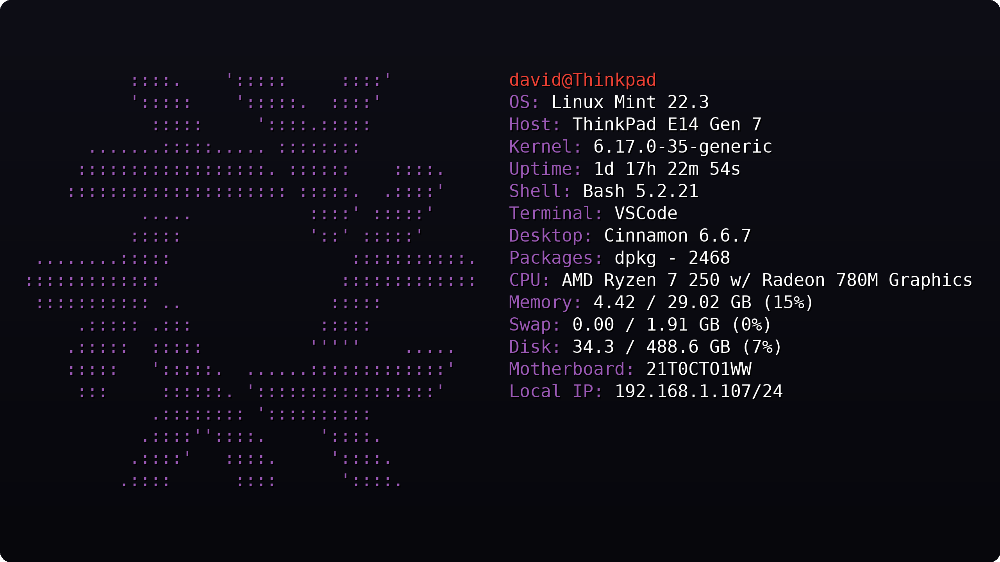

# Dfetch

Dfetch is a lightweight system information tool focused on clean output, fast startup times, and simple configuration. It provides useful system details without the complexity of heavily customizable alternatives.

<table>
  <tr>
    <td></td>
    <td></td>
  </tr>
  <tr>
    <td></td>
    <td></td>
  </tr>
</table>

## Features

```txt
- Fast startup time
- Simple configuration file
- Useful system information without clutter
- Custom ASCII art support
- Configurable module ordering
- No external dependencies
- Clean default look
```

## Why use this?

Dfetch doesn't aim to compete with highly customizable tools such as Neofetch or Fastfetch. Instead, it focuses on providing clean output, sensible defaults, fast startup times, and straightforward configuration.


## Installation

Currently, no official packages are available for any platform. You can either build Dfetch from source or [download the latest prebuilt binaries](https://github.com/David17c/Dfetch/releases). Platform-specific packages will be provided when version 1.0.0 is released.

## Customization

`~/.config/Dfetch/Dfetch.conf`

```
// Lines starting with `//` are comments and are ignored by Dfetch.
// In the modules section, you can change which information is displayed and in what order.

// The 'emptyline' module can be used to insert an empty line between modules.
modules {
	userinfo
	os
	host
	kernel
	uptime
	packages
	shell
	de
	terminal
	cpu
	memory
	disk
	motherboard
	localip
	// battery
	// time
	// date
}

custom_ascii: default
// Set a custom ASCII logo by providing the path to a text file containing it.

accent_color: default
// Color used for the information labels.

// Available colors:
// black, red, green, yellow, blue,
// magenta, cyan, white,
// bright_black, bright_red,
// bright_green, bright_yellow,
// bright_blue, bright_magenta,
// bright_cyan, bright_white
```

## Supported Linux distros

```txt
- Arch
- Bazzite
- CachyOS
- Debian
- Fedora
- Linux Mint
- Manjaro
- OpenSUSE Leap
- OpenSUSE Tumbleweed
- Pop!_OS
- Ubuntu
- Zorin OS
```

If your favorite distro isn't listed, it may still be supported. This list only includes distributions that have built-in ASCII art and have been tested.

## How to make a custom ascii art

Put the ASCII art you want to use into a `txt` file. It should look something like this.

```
             ...-:::::-...
          .-MMMMMMMMMMMMMMM-.
      .-MMMM`..-:::::::-..`MMMM-.
    .:MMMM.:MMMMMMMMMMMMMMM:.MMMM:.
   -MMM-M---MMMMMMMMMMMMMMMMMMM.MMM-
  :MMM:MM`  :MMMM:....::-...-MMMM:MMM:
 :MMM:MMM`  :MM:`  ``    ``  `:MMM:MMM:
.MMM.MMMM`  :MM.  -MM.  .MM-  `MMMM.MMM.
:MMM:MMMM`  :MM.  -MM-  .MM:  `MMMM-MMM:
:MMM:MMMM`  :MM.  -MM-  .MM:  `MMMM:MMM:
:MMM:MMMM`  :MM.  -MM-  .MM:  `MMMM-MMM:
.MMM.MMMM`  :MM:--:MM:--:MM:  `MMMM.MMM.
 :MMM:MMM-  `-MMMMMMMMMMMM-`  -MMM-MMM:
  :MMM:MMM:`                `:MMM:MMM:
   .MMM.MMMM:--------------:MMMM.MMM.
     '-MMMM.-MMMMMMMMMMMMMMM-.MMMM-'
       '.-MMMM``--:::::--``MMMM-.'
            '-MMMMMMMMMMMMM-'
               ``-:::::-``
```

You can optionally add colors by using color tags. For a list of supported colors look at the default config file.

```
             ${bright_white}...-:::::-...
${bright_white}          .-MMMMMMMMMMMMMMM-.
${bright_white}      .-MMMM${green}`..-:::::::-..`${bright_white}MMMM-.
${bright_white}    .:MMMM${green}.:MMMMMMMMMMMMMMM:.${bright_white}MMMM:.
${bright_white}   -MMM${green}-M---MMMMMMMMMMMMMMMMMMM.${bright_white}MMM-
${bright_white}  :MMM${green}:MM`  :MMMM:....::-...-MMMM:${bright_white}MMM:
${bright_white} :MMM${green}:MMM`  :MM:`  ``    ``  `:MMM:${bright_white}MMM:
${bright_white}.MMM${green}.MMMM`  :MM.  -MM.  .MM-  `MMMM.${bright_white}MMM.
${bright_white}:MMM${green}:MMMM`  :MM.  -MM-  .MM:  `MMMM-${bright_white}MMM:
${bright_white}:MMM${green}:MMMM`  :MM.  -MM-  .MM:  `MMMM:${bright_white}MMM:
${bright_white}:MMM${green}:MMMM`  :MM.  -MM-  .MM:  `MMMM-${bright_white}MMM:
${bright_white}.MMM${green}.MMMM`  :MM:--:MM:--:MM:  `MMMM.${bright_white}MMM.
${bright_white} :MMM${green}:MMM-  `-MMMMMMMMMMMM-`  -MMM-${bright_white}MMM:
${bright_white}  :MMM${green}:MMM:`                `:MMM:${bright_white}MMM:
${bright_white}   .MMM${green}.MMMM:--------------:MMMM.${bright_white}MMM.
${bright_white}     '-MMMM${green}.-MMMMMMMMMMMMMMM-.${bright_white}MMMM-'
${bright_white}       '.-MMMM${green}``--:::::--``${bright_white}MMMM-.'
${bright_white}            '-MMMMMMMMMMMMM-'
${bright_white}               ``-:::::-``
accent_color: green
```

At the bottom of the file add an accent_color: `accent_color: green`. This is the color given to the info module labels.

Now in the config file add / edit `custom_ascii: PATH_TO_FILE`. Dfetch should now be using your ASCII art.