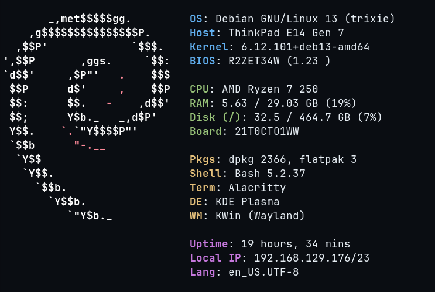

# Dfetch

Dfetch is a lightweight command-line tool for displaying system information. It focuses on clean output, fast startup times, and simple configuration.

## Installation

To install Dfetch, visit the [releases page](https://github.com/David17c/Dfetch/releases) and download either the package for your operating system or a prebuilt binary.

More detailed installation instructions and instruction on building Dfetch from source can be found [here](documentation/INSTALL.md).

## Supported distributions

Dfetch currently supports Linux and includes built-in ASCII art for:

**Alma Linux, Arch, Artix, Bazzite, CachyOS, Debian, EndeavourOS, Fedora, Gentoo, Kali Linux, Linux Mint, Manjaro, NixOS, OpenSUSE Leap, OpenSUSE Tumbleweed, Pop!_OS, Rocky Linux, Tuxedo OS, Ubuntu, Vanilla OS, Void Linux and Zorin OS.**

If your distribution isn't listed, Dfetch may still work. This list only includes distributions with built-in ASCII art.

The supported distributions have been tested, but Dfetch is not continuously tested on every distribution, so some issues may go unnoticed.

## Documentation

* [Customization](documentation/CUSTOMIZATION.md)
* [Installation Instructions](documentation/INSTALL.md)

 

